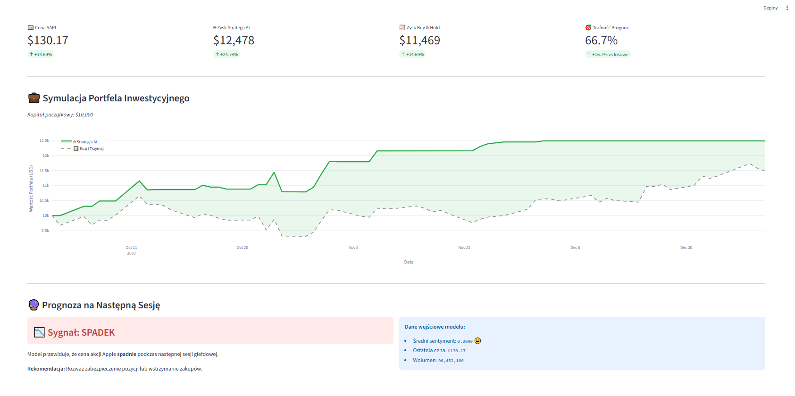
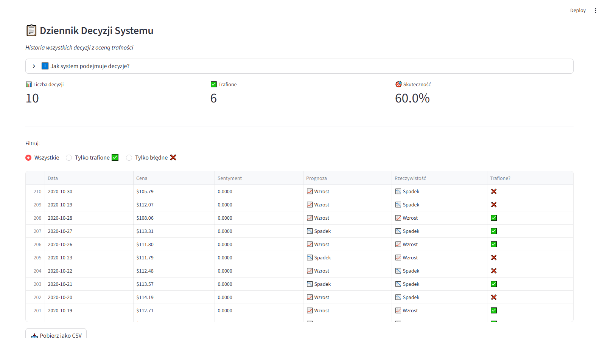

# Stock Sentiment Prediction

End-to-end machine learning system predicting short-term stock price direction from financial news sentiment. Built as a BSc thesis project at the University of Silesia, combining a domain-specific NLP model (FinBERT) with gradient boosting classification and an interactive dashboard.

## Problem

Financial news moves markets - but does the *sentiment* of news headlines carry enough signal to predict where a stock goes next?

The research question:

> Can sentiment extracted from financial news headlines predict the direction of a stock's price movement over the following trading day?

The system scores each headline with FinBERT, aggregates sentiment per trading day, joins it with market data, and trains a classifier to predict whether tomorrow's close will be higher than today's.

## Data

| Source | Content |
|---|---|
| Yahoo Finance (`yfinance`) | Daily OHLCV prices for AAPL |
| Kaggle — Analyst Ratings dataset | 1.4M financial news headlines (filtered to AAPL) |

**Period:** March – June 2020 (constrained by news coverage, see *Limitations*)
**Final dataset:** ~64 trading days with both price and sentiment data

## Pipeline

```
data_loader.py        →  download OHLCV prices from Yahoo Finance
import_kaggle.py      →  filter the Kaggle news dataset down to one ticker
sentiment_analyzer.py →  score each headline with FinBERT (positive / neutral / negative + confidence)
feature_engineer.py   →  aggregate sentiment per day, join with prices, build the target variable
model_trainer.py      →  train and evaluate the XGBoost classifier
model_optimizer.py    →  hyperparameter search with TimeSeriesSplit
visualize_strategy.py →  simulate a trading strategy against buy-and-hold
app.py                →  Streamlit dashboard
```

### Design decisions worth noting

**Sentiment scoring.** FinBERT returns a label and a confidence score. These are combined into a single signed value (positive sentiment keeps its score, negative sentiment is negated, neutral becomes zero), then averaged per trading day.

**Joining news to prices.** News published over a weekend has no matching trading session, so a plain date join loses data. The pipeline uses `merge_asof` with `direction='backward'` and a 3-day tolerance: each trading session is matched with the most recent sentiment from that day or earlier.

**Chronological splitting.** The train/test split is strictly chronological (80/20) — never shuffled. The same applies to hyperparameter search, which uses `TimeSeriesSplit` rather than standard k-fold. Shuffling time-series data leaks future information into training and produces optimistic results that do not hold in practice.

## Results

Test set: 51 trading days.

| Class | Precision | Recall | F1 |
|---|---|---|---|
| Down (0) | 0.54 | 0.76 | 0.63 |
| Up (1) | 0.62 | 0.38 | 0.48 |
| **Accuracy** | | | **0.57** |

Against a 50% random baseline, the model reaches **57% directional accuracy**.

The class-level metrics are more interesting than the headline number: the model is noticeably better at predicting declines (76% recall) than gains (38% recall). In practice it behaves conservatively — it more often says "don't buy" than "buy", which limits exposure to losses at the cost of missing upside.

**Hyperparameter tuning did not help.** A grid search over `n_estimators`, `max_depth`, `learning_rate` and `subsample` with `TimeSeriesSplit` produced 54.9% — worse than the default configuration. With only ~50 test observations, the search optimises for noise in the validation folds rather than generalisable structure. The default parameters were kept.

## Limitations

These are real constraints of the project, not oversights:

- **Small dataset.** ~64 trading days total, 51 in the test set. A single correctly or incorrectly classified day shifts accuracy by roughly 2 percentage points, so the result carries substantial variance.
- **Narrow time window.** The Kaggle news dataset covered AAPL only from March to June 2020 — a period dominated by the COVID crash and rebound, which is far from typical market behaviour. Price data was restricted to match.
- **Headlines only.** Sentiment is scored on titles, not article bodies. Headlines are short and often ambiguous, which limits how much signal FinBERT can extract.
- **No transaction costs.** The strategy simulation ignores commissions and slippage, so returns are optimistic.

## Reproducing the results

The dataset files are not included in this repository (see `.gitignore`). To reproduce:

```bash
git clone https://github.com/bzietek/stock-sentiment-prediction.git
cd stock-sentiment-prediction

python -m venv venv
venv\Scripts\activate          # Windows
pip install -r requirements.txt
```

Download the [Analyst Ratings dataset](https://www.kaggle.com/datasets/miguelaenlle/massive-stock-news-analysis-db-for-nlpbacktests) from Kaggle and place `analyst_ratings_processed.csv` in `data/` as `kaggle_news.csv`.

Then run the pipeline in order, from the project root:

```bash
python src/data_loader.py         # prices
python src/import_kaggle.py       # news
python src/sentiment_analyzer.py  # FinBERT scoring (downloads ~400MB on first run)
python src/feature_engineer.py    # final dataset
python src/model_trainer.py       # training and evaluation
streamlit run src/app.py          # dashboard
```

## Dashboard

The Streamlit application presents predictions, sentiment trends and a portfolio simulation comparing the model's signals against a buy-and-hold benchmark.




## Tech stack

**ML & NLP:** Python, Hugging Face Transformers (FinBERT), XGBoost, scikit-learn
**Data:** Pandas, NumPy, yfinance
**Visualisation:** Streamlit, Plotly, Matplotlib, Seaborn

## Thesis

The full thesis (in Polish) is available in [`thesis/praca_inzynierska.pdf`](thesis/praca_inzynierska.pdf).

## Author

**Bartosz Ziętek** — [LinkedIn](https://linkedin.com/in/bartosz-zietek) · [GitHub](https://github.com/bzietek)

BSc Computer Science, University of Silesia in Katowice
